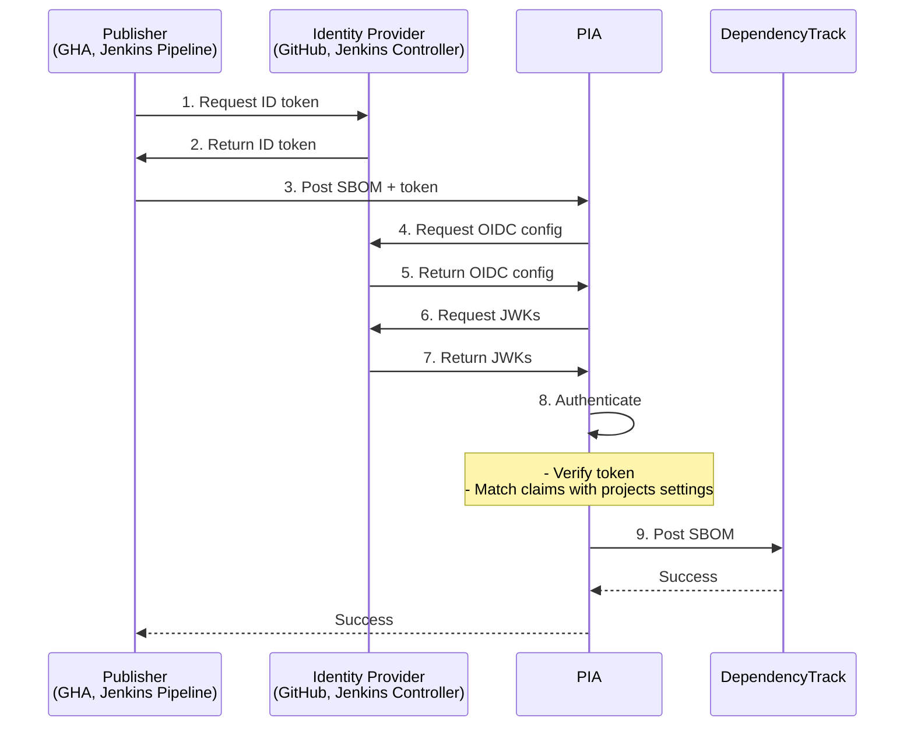

# PIA - Project Identity Authority

Design Document v0.1

## 1. Overview

### 1.1 Purpose

PIA (Project Identity Authority) is an authentication broker for Eclipse
Foundation projects. It allows projects to publish artifacts, and to proof that
the artifact came from the project's build infrastructure, using OpenID Connect
(OIDC).

In the initial use case, described in this document, PIA serves as intermediary
between Eclipse build infrastructure (GitHub Actions, Jenkins Pipelines) and
the Eclipse DependencyTrack registry. This enables project-level access control
for SBOM uploads to DependencyTrack. Later, PIA may extend to other use cases that
benefit from this authentication.

### 1.2 Problem Statement

DependencyTrack lacks project-level access control:
- Any team with upload permissions can publish SBOMs for all projects
- Shared secrets management is complex and error-prone
- Workarounds exist but are restricted to GitHub Actions

### 1.3 Solution

PIA implements a "Trusted Publishing" architecture using OIDC to:
- Authenticate publishers using short-lived identity tokens
- Verify project ownership through Identity Provider claims
- Eliminate need for long-lived credentials and manual secrets management
  between build infrastructure and DependencyTrack
- Support multiple build platforms (GitHub Actions, Jenkins, extensible to others)
- Provide a scalable architecture (extensible to other artifacts and registries)

## 2. Architecture

### 2.1 Components



#### Publisher
- GitHub Action workflow or Jenkins Pipeline
- Generates SBOMs
- Requests identity token from its Identity Provider
- Sends SBOM + token to PIA

#### Identity Provider
- **GitHub**: Central OIDC provider (provided by GitHub)
- **Jenkins**: Per-instance OIDC Provider (enabled via plugin)
- Issues cryptographically signed JWT tokens with claims about publisher identity
- Serves OIDC configuration and public keys from well known location

#### PIA
- Provides REST API for SBOM upload
- Verifies identity tokens using OIDC discovery protocol
- Authenticates SBOM based on OIDC claims and internal projects settings
- Publishes SBOM to DependencyTrack on behalf of authenticated projects

#### DependencyTrack
- Receives SBOM from PIA after successful authentication

### 2.2 Trust Relationships

1. **Identity Provider** trusts **Publisher** because:
   - Each GitHub Publisher has a built-in auth token for the central GitHub
     Identity Provider (managed by GitHub)
   - Each Jenkins Publisher has its own Identity Provider running on the same
     Jenkins instance (managed by Eclipse Foundation)
2. **PIA** trusts **Identity Provider** because PIA has projects settings for
   Identity Provider (issuer) URLs (managed by Eclipse Foundation)
3. **DependencyTrack** trusts **PIA** because PIA has an auth token for
   the DependencyTrack API (managed by Eclipse Foundation)

## 3. Authentication Flow

### 3.1 Detailed Flow

1. **Token Request**: Publisher requests ID token from Identity Provider

   - GitHub: Uses `ACTIONS_ID_TOKEN_REQUEST_URL` and `ACTIONS_ID_TOKEN_REQUEST_TOKEN`
   - Jenkins: Uses credentials binding plugin with pre-configured credential

2. **Token Issuance**: Identity Provider returns JWT with minimal required claims:

   - `iss`: Issuer URL (identifies Identity Provider)
   - `exp`: Expiration timestamp
   - `iat`: Issued At timestamp
   - `aud`: Audience (must match PIA's expected audience)
   - Platform-specific:
     - GitHub: `repository` identifies project via repository owner and name
     - Jenkins: `iss` also identifies project via URL path

3. **Publish Request**: Publisher sends POST request to PIA:

   - `project_id`: Unique Eclipse Foundation project ID.
   - `product_name`: Name of product for which the SBOM is produced. This field
     is required by DependencyTrack to aggregate SBOMs by product within a
     project. We ask the Publisher to provide it, so that we don't have to
     parse the SBOM (see `metadata.component.name`).
   - `product_version`: Version of product for which the SBOM was produced.
     This field is required by DependencyTrack. We ask the Publisher to
     provide it, so that we don't have to parse the SBOM (see
     `metadata.component.version`).
   - `bom`: Base64-encoded CycloneDX JSON SBOM
   - `token`: OIDC token

4. **Token Verification and Authentication**: PIA verifies POST data token

   - see 3.1.1. Token Verification and Authentication Flow

5. **SBOM Publishing**: PIA sends POST request to DependencyTrack:

   - `Content-Type`: `application/json`
   - `X-Api-Key`: Use internally stored, DependencyTrack access token
   - `projectName`: Use `product_name` from POST data
   - `projectVersion`: Use `product_version` from POST data.
   - `parentUUID`: Look up internally via `project_id`
   - `autoCreate`: `true` (creates new subcategory for new `projectName`)
   - `bom`: Use `bom` from POST data

#### 3.1.1 Token Verification and Authentication Flow

1. Basic POST Data Validation
   1. Validate basic POST data schema
   2. Verify `project_id` is known and allowed
2. Issuer Validation
   1. Decode token without any verification
   2. Extract issuer
   3. Verify issuer is known and allowed for `project_id`
3. Token Key Discovery
   1. Fetch OIDC configuration from `{issuer}/.well-known/openid-configuration`
   2. Extract `jwks_uri` from configuration
   3. Fetch public keys from `jwks_uri`
   4. Match key using `kid` claim from token header
4. Token Validation and Signature Verification
   1. Verify required claims are present
   2. Verify token issued at time and expiry
   3. Verify audience matches expected value
   4. Verify signature using RSA256
5. Project Authorization
   1. Verify that platform specific claims are correct for `project_id`

## 4. API Design

### 4.1 Endpoints

#### POST /v1/upload/sbom

Accepts sbom uploads with OIDC authentication.

**Request:**
```json
{
  "project_id": "string",           // Eclipse project ID
  "product_name": "string",         // Eclipse product name
  "product_version": "string",      // Eclipse product version
  "bom": "string",                  // CycloneDX JSON SBOM (base64-encoded)
  "token": "string",                // JWT ID token
}
```

**Response:**
- `400 Bad request`: Invalid request data
- `401 Unauthorized`:
  - Project not allowed
  - Invalid token
  - Expired token
  - Token verification error
  - Issuer not allowed
  - Project token claim mismatch
- `502`: DependencyTrack post request failed
- `*`: Relay DependencyTrack status code


### 4.2 Settings

PIA requires settings for:

1. **Application**: Loaded from environment variables with `PIA_` prefix:
    - `PIA_DEPENDENCY_TRACK_API_KEY`: DependencyTrack API key (required)
    - `PIA_PROJECTS_PATH`: Path to projects.yaml file (required)
    - `PIA_DEPENDENCY_TRACK_URL`: DependencyTrack SBOM upload URL
      (default: `https://sbom.eclipse.org/api/v1/bom`)
    - `PIA_EXPECTED_AUDIENCE`: Expected audience for OIDC tokens
      (default: `pia.eclipse.org`)

2. **Projects**: YAML file (e.g. `projects.yaml`) that maps project ID to
    allowed issuer, required claims, and DependencyTrack project UUID. Schema:
    ```yaml
    <project_id>:
      issuer: <issuer_url>
      dt_parent_uuid: <uuid>  # DependencyTrack project UUID
      required_claims:        # Omit for Jenkins (issuer is enough)
        <claim_name>: <expected_value>
    ```
    NOTE: Initial implementation uses static YAML; designed for future database
    migration.


## 5. Implementation Details

### 5.1 Technology Stack

- **Web Framework**: FastAPI (modern, has built-in model validation and API documentation)
- **HTTP Client**: `requests` for OIDC discovery and DependencyTrack API calls
- **JWT Library**: `PyJWT` with `cryptography` support
  - Handles token parsing, validation, and signature verification
  - Includes `PyJWKClient` for JWKS key fetching
- **Testing**: `pytest`
- **Linting**: `ruff`
- **Python Project Management**: `uv`

### 5.2 Project Structure

```
pia/
    docs/
        DESIGN.md            # Design document (this)
    pia/
        __init__.py
        dependencytrack.py
        main.py
        models.py
        oidc.py
    tests/
        conftest.py
        test_dependencytrack.py
        test_main.py
        test_models.py
        test_oidc.py
    projects.yaml.example    # Example projects settings
    pyproject.toml
    README.md
    .gitignore
```

### 5.3 Core Modules

- `__init__.py`: Package version and metadata
- `main.py`: FastAPI app with:
  - Settings management for application and project settings
  - Upload SBOM API endpoint implementing full authentication and
    DependencyTrack upload flow (section 3.1, items 4. and 5.)
- `oidc.py`: OIDC token validation and signature verification using PyJWT
- `dependencytrack.py`: DependencyTrack API upload client for SBOMs
- `models.py`: Pydantic data models with validation and authentication:
  - `Project`: Project settings instance
  - `Projects`: Map of project IDs to Project instances
  - `PiaUploadPayload`: Request model for PIA Upload SBOM API endpoint
  - `DependencyTrackUploadPayload`: Request model for DependencyTrack API

### 5.4 Error Handling

- **Settings Errors**: Fail fast at startup with clear error

- **Authentication Errors**:
  - 400 for malformed POST data
  - 401 for unknown project, issuer and token verification or authentication
    errors

- **DependencyTrack Upload Errors**: 502, if upload fails with an error, or HTTP
    status code from DependencyTrack

### 5.5 Logging and Monitoring

Log important events:
- Settings re-load
- Client connects
- Token verifications
- DependencyTrack uploads
- Errors

Metrics to track:
- Client connect attempts by IP
- Client connect attempts by `project_id` and `product_name`
- Token verification time
- DependencyTrack upload time
- Total API response time

## 6. Security Considerations

### 6.1 Token Validation

- **Issuer and Project**: Only trust allowed issuers and projects
- **Expiration**: Reject expired tokens
- **Signature**: Verify signature before trusting claims
- **Algorithm**: Only accept RS256 (Identity Provider restriction)
- **Key Rotation**: Refresh OIDC configs and JWKs

### 6.2 Attack Vectors

| Attack | Mitigation |
|--------|-----------|
| Token replay | Short-lived tokens (5-10 min), do not re-use token  (future work) |
| Issuer spoofing | HTTPS-only issuer URLs, strict URL validation |
| Token forgery | Cryptographic signature verification |
| Project impersonation | Claim-to-project validation |
| DoS via OIDC discovery | Cache OIDC discovery, rate limit requests (both future work) |
| Parsing vulnerabilities | Use minimal schema for unauthenticated POST data, use well-tested JWT library for token parsing |

### 6.3 Secrets Management

- Store secrets securely in environment variables
- Never log tokens or credentials
- Rotate DependencyTrack credentials regularly

### 6.4 HTTPS Requirements

- All communication must use HTTPS:
  - PIA API endpoint
  - OIDC discovery URLs
  - DependencyTrack API endpoint

## 7. Platform-Specific Details

### 7.1 GitHub Actions

**Identity Provider**:
- Issuer: `https://token.actions.githubusercontent.com`
- OIDC config path: `/.well-known/openid-configuration`

**Required Claims**:
- `repository`: identifies Eclipse project (e.g. `eclipse-foo/bar` identifies
  project Eclipse Foo)

**Example Publisher workflow**:
```yaml
jobs:
  publish:
    permissions:
      id-token: write
    steps:
      - name: Get ID token
        id: token
        run: |
            ID_TOKEN=$(curl \
                -H "Authorization: bearer $ACTIONS_ID_TOKEN_REQUEST_TOKEN" \
                "$ACTIONS_ID_TOKEN_REQUEST_URL&audience=pia.eclipse.org")

            echo "ID_TOKEN=$ID_TOKEN" >> $GITHUB_OUTPUT

      - name: Publish SBOM
        run: |
          curl -X POST https://pia.eclipse.org/v1/upload/sbom \
            -H "Content-Type: application/json" \
            -d '{"project_id": "<PROJECT ID>", "token": "${{ steps.token.outputs.ID_TOKEN }}", ...}'
```

### 7.2 Jenkins

**Identity Providers (one per project)**:
- Issuer: `https://ci.eclipse.org/<PROJECT NAME>/oidc`
- OIDC config path: `/.well-known/openid-configuration`

**Required Claims**:
- The issuer also identifies the project (e.g.
  `https://ci.eclipse.org/eclipse-baz/oidc` identifies project Eclipse Baz)

**Publisher Setup**:
- Install plugins: `oidc-provider`, `credentials-binding`
- Configure per-project Jenkins instance URL
- Create `id-token` credential
  - Set `GLOBAL` scope, to make tokens available to jobs
  - Set audience, to prevent cross-service token replay

**Example Publisher Credential Setup**:
```yaml
credentials:
  system:
    domainCredentials:
    - credentials:
      - idToken:
          id: id-token
          scope: GLOBAL
          audience: pia.eclipse.org
```

**Example Publisher Pipeline**:
```groovy
pipeline {
    agent any
    environment {
        ID_TOKEN = credentials('id-token')
    }
    stages {
        stage('Publish') {
            steps {
                sh '''
                  curl -X POST https://pia.eclipse.org/v1/upload/sbom \
                    -H "Content-Type: application/json" \
                    -d '{"project_id": "<PROJECT ID>", "token": "${ID_TOKEN}", ...}'
                '''
            }
        }
    }
}
```

## 8. Deployment

### 8.1 Environment

- Python 3.13.2+
- Production ASGI server (e.g., uvicorn)
- Reverse proxy for TLS termination and rate limiting
- Container deployment

### 8.2 Settings

Settings via:
1. YAML file (`projects.yaml`) for project/issuer settings
2. Environment variables (with `PIA_` prefix) for application settings

Example `projects.yaml`:
```yaml
my-github-project:
  issuer: "https://token.actions.githubusercontent.com"
  dt_parent_uuid: "12345678-1234-1234-1234-123456789abc"
  required_claims:
    repository: "eclipse-foo/my-github-project"

my-jenkins-project:
  issuer: "https://ci.eclipse.org/my-jenkins-project/oidc"
  dt_parent_uuid: "87654321-4321-4321-4321-cba987654321"
```

Required environment variables:
```bash
PIA_DEPENDENCY_TRACK_API_KEY=<your-api-key>
PIA_PROJECTS_PATH=/path/to/projects.yaml
PIA_DEPENDENCY_TRACK_URL=https://sbom.eclipse.org/api/v1/bom  # optional, has default
PIA_EXPECTED_AUDIENCE=pia.eclipse.org  # optional, has default
```

### 8.3 Scalability

- Stateless: Can run multiple instances behind load balancer
- Rate limiting per project/IP at reverse proxy level, if needed
- Async processing, if needed

## 9. Testing Strategy

### 9.1. Unit Tests

- Settings loading and validation (pydantic-settings)
- Model validation (pydantic models)
- Token verification and authentication logic with test tokens
- Error handling paths

### 9.2. Integration tests
- FastAPI endpoints using httpx async test client
- DependencyTrack upload with mock server

## 10. Future Work

- Replace yaml-based projects settings with database
- Add caching for oidc config and jwks
- Add monitoring
- Make upload API async, if sync takes too long
- Protect against replayed tokens (PyPI uses "jti" claim to track used tokens)
- Consider product-level authentication

## 11. References

- [Trusted Publishing (PyPI)](https://docs.pypi.org/trusted-publishers/)
- [GitHub OIDC Documentation](https://docs.github.com/en/actions/deployment/security-hardening-your-deployments/about-security-hardening-with-openid-connect)
- [Jenkins OIDC Provider Plugin](https://plugins.jenkins.io/oidc-provider/)
- [PyJWT Documentation](https://pyjwt.readthedocs.io/)
- [End-to-end Proof of Concept](https://gitlab.eclipse.org/lukpueh/oidc-upload-demo)
- [Concept Document (restricted access)](https://docs.google.com/document/d/1DuvC7vRsbJQpY9q4selLuAuAO4AUXiyEmHrK-xQ6GW0/edit?tab=t.0#heading=h.k5o4i1fbhpd2)


## Appendix A: Token Examples

### GitHub Actions Token

```json
{
  "jti": "...",
  "sub": "repo:octo-org/octo-repo:ref:refs/heads/main",
  "aud": "pia.eclipse.org",
  "ref": "refs/heads/main",
  "sha": "...",
  "repository": "octo-org/octo-repo",
  "repository_owner": "octo-org",
  "run_id": "...",
  "run_number": "...",
  "run_attempt": "...",
  "actor": "octocat",
  "workflow": "CI",
  "head_ref": "",
  "base_ref": "",
  "event_name": "push",
  "ref_type": "branch",
  "job_workflow_ref": "octo-org/octo-repo/.github/workflows/ci.yml@refs/heads/main",
  "iss": "https://token.actions.githubusercontent.com",
  "nbf": 1632492000,
  "exp": 1632492900,
  "iat": 1632492000
}
```

### Jenkins Token

```json
{
    "aud": "pia.eclipse.org",
    "build_number": 2,
    "exp": 1765461015,
    "iat": 1765457415,
    "iss": "https://ci.eclipse.org/my-project/oidc",
    "sub": "https://ci.eclipse.org/my-project/job/oidc-upload-demo/"
}
```
